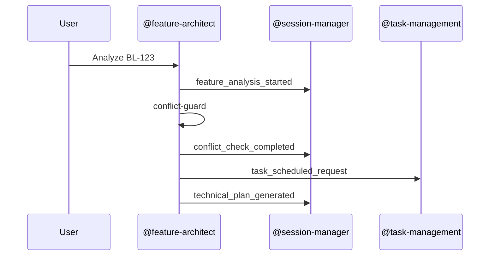

# Event Schema

This document defines the standard event structure used for communication between agents and skills in the framework, ensuring interoperability and traceability.

## Objectives

- Provide a stable, extensible event format.
- Keep events local-first and tool-agnostic.
- Support session logging and task scheduling.

## Base Event Structure

```json
{
  "event_id": "string",
  "timestamp": "string (ISO 8601)",
  "source_component": "string",
  "event_type": "string",
  "payload": {}
}
```

## Event Types

### feature_analysis_started

- Source: @feature-architect
- Purpose: Start analysis for a backlog item.

Payload:

```json
{
  "backlog_id": "string",
  "description": "string"
}
```

### conflict_check_completed

- Source: @feature-architect (conflict-guard)
- Purpose: Report conflict check results.

Payload:

```json
{
  "has_conflicts": "boolean",
  "conflicts": [
    {
      "type": "string",
      "message": "string",
      "offending_path": "string | null",
      "existing_component": "string | null",
      "severity": "low" | "medium" | "high"
    }
  ],
  "warnings": []
}
```

### technical_plan_generated

- Source: @feature-architect
- Purpose: A technical plan document has been generated.

Payload:

```json
{
  "backlog_id": "string",
  "document_path": "string",
  "summary": "string"
}
```

### task_scheduled_request

- Source: @feature-architect or other agents
- Purpose: Request task scheduling by task-management.

Payload:

```json
{
  "task_name": "string",
  "command": "string",
  "schedule_at": "string (ISO 8601) | null",
  "recurring": "boolean"
}
```

### session_log_entry_created

- Source: any component
- Purpose: Add a log entry to the current session.

Payload:

```json
{
  "message": "string",
  "level": "INFO" | "WARN" | "ERROR"
}
```

## Example Flow



## Notes

- Event payloads should remain compact and deterministic.
- Consumers must ignore unknown fields to preserve forward compatibility.
