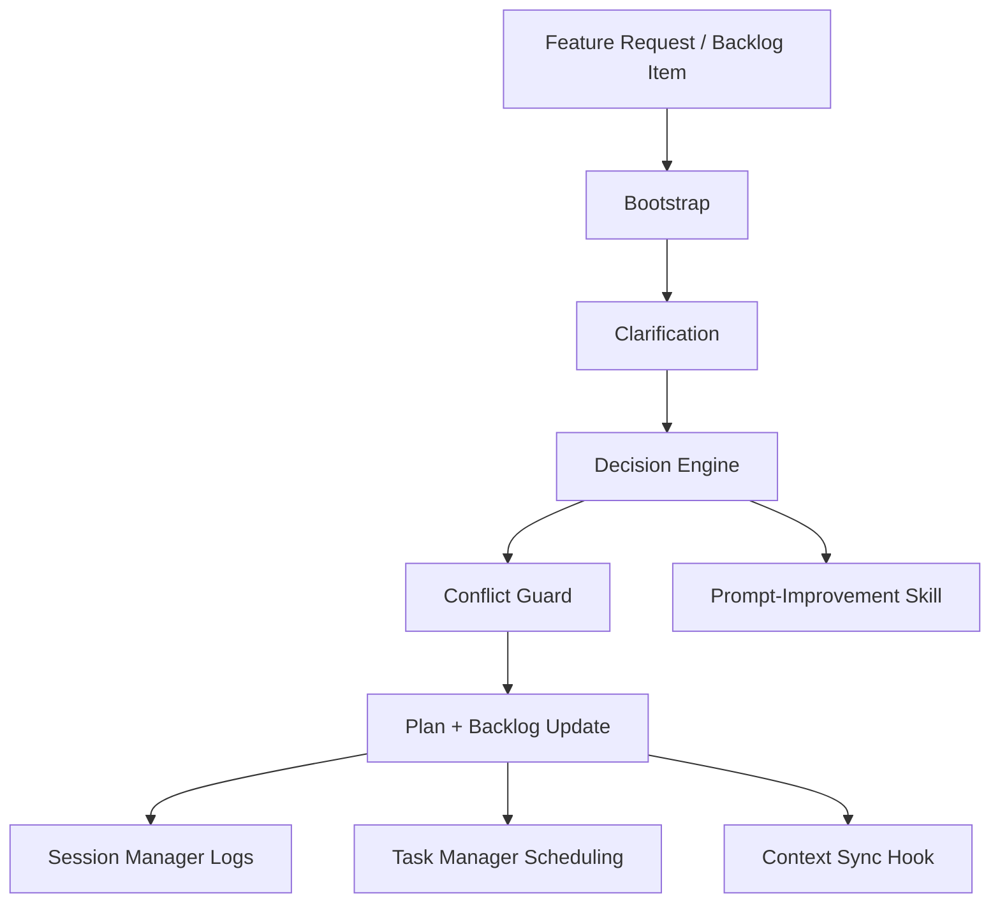

# Feature Architect (BL-068)

The feature-architect is a core agent that validates, clarifies, and plans feature work before implementation. It is responsible for preventing overlaps, enforcing local-first rules, and producing a clean technical plan aligned with the framework philosophy.

## Objectives

- Provide a structured flow: bootstrap -> clarification -> evaluation -> execution plan -> backlog update.
- Detect overlaps and conflicts across skills, agents, and dependencies before changes land.
- Use existing framework resources first (local context, local tools, existing agents/skills).
- Keep context compact and traceable with explicit artifacts.

## Scope and Responsibilities

- Clarify requirements and reduce ambiguity.
- Validate scope against backlog to avoid duplicates.
- Route decisions via the decision-engine.
- Trigger overlap/conflict checks (conflict-guard module) and record results in FAR.
- Produce a technical plan and update backlog items.

## Acceptance Criteria (from BL-068)

- Agent created with bootstrap, clarification, evaluation, execution and backlog-compatible tooling.
- Compatible with local-first and framework governance.

## Dependencies and Related Items

- BL-069 conflict-guard: overlap/conflict validation (depends on BL-068).
- BL-060 decision-engine: routing and policy decisions (completed).
- BL-044 prompt-improvement: prompt clarity and refinement (completed).
- BL-071/BL-072 session-manager with native tracking (completed).
- BL-014 context-sync and BL-013 traceability (pending).

## Overlap Analysis and Resolution

| Item | Overlap/Dependency | Risk | Resolution |
| --- | --- | --- | --- |
| BL-069 conflict-guard | Same validation goal as BL-068 | Duplicate logic | Integrate as a submodule of feature-architect |
| session-manager (BL-071/BL-072) | Logging and session tracking | Split sources of truth | Consume session-manager for logging only |
| context-sync (BL-014) | Pre-sync checks | Ordering conflicts | Add pre-sync hook from feature-architect |
| decision-engine (BL-060) | Routing logic | Conflicting rules | Use decision-engine as the router |
| prompt-improvement (BL-044) | Clarification prompts | Duplicate prompting | Consume as a skill |
| task-management (BL-047) | Execution scheduling | Ownership ambiguity | Feature-architect outputs tasks; task-manager schedules |

## Integration Decisions

| Component | Integrate | Consume | N/A | Rationale |
| --- | --- | --- | --- | --- |
| decision-engine (BL-060) | Yes | - | - | Core router and policy engine |
| conflict-guard (BL-069) | Yes | - | - | Direct dependency, avoid duplication |
| session-manager (BL-071/BL-072) | - | Yes | - | Centralized session logs and tracking |
| context-sync (BL-014) | Yes | - | - | Pre-sync validation hook |
| prompt-improvement (BL-044) | - | Yes | - | Reuse specialized prompting |
| task-management (BL-047) | - | Yes | - | Separation of planning vs scheduling |

## Architecture (Draft)

## Principles Applied (Context Engineering)

Source: https://github.com/muratcankoylan/Agent-Skills-for-Context-Engineering

- Progressive disclosure: load only the minimum backlog metadata until needed.
- Platform-agnostic flows: keep prompts and steps tool-neutral.
- Context compression: store compact reports and re-use them.
- Memory separation: session data in session-manager; product data in backlog.
- Small, composable tools: validation, routing, and reporting are discrete.

## Artifacts and Outputs

- Feature Analysis Report (summary of scope, overlaps, decisions, risks).
- FAR format: docs/architecture/feature-analysis-report.mdx
- Backlog update with decisions and dependencies.
- Event log entries sent to session-manager.

## Validation Notes

- When conflict-guard is updated, run the smoke tests in docs/architecture/conflict-guard-interface.mdx.

## Suggested Follow-up Backlog Items

- BL-068.1 Define a stable interface for conflict-guard inputs/outputs.
- BL-068.2 Event schema for session-manager + task-manager integration.
- BL-068.3 Standard format for Feature Analysis Report (compact, reusable).
